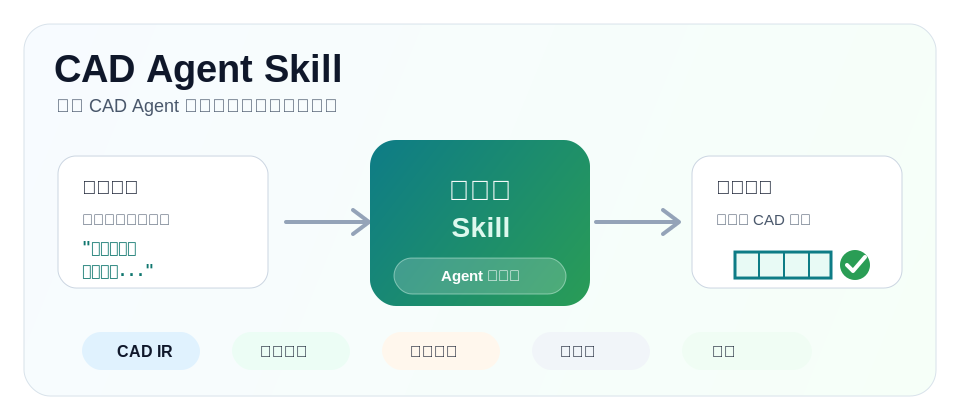
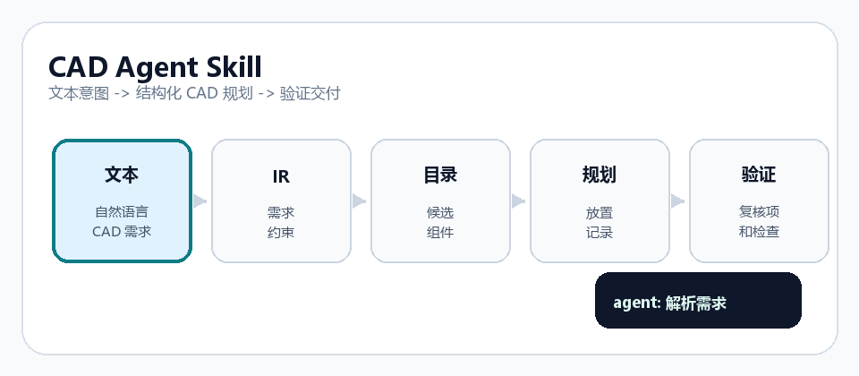

# CAD Agent Skill

<div align="center">

**CAD 工业设计辅助 Skill**  
从自然语言到 CAD 交付：让几何决策可追溯、可复现、可交接

<a href="README.md"></a>
<a href="README.en.md"></a>
<a href="https://github.com/Zc030201/cad-agent-skill/actions/workflows/test.yml"></a>
<a href="LICENSE"></a>

</div>

<p align="center">
  
</p>

<p align="center">
  
</p>

## 适用问题

在 CAD 自动化里，很多场景会遇到三个问题：

1. 需求表达不统一，Agent 容易误解  
2. 组件选择和放置决策难以追溯  
3. 下游建模前缺少一致的校验标准  

`CAD Agent Skill` 解决这三件事：先把任务变成结构化中间产物，再由下游建模系统执行。

## 解决路径

```text
文本 / 参数需求
        |
        v
    CAD IR
        |
        v
组件目录检索 -> 放置规划 -> 执行图 -> 验证报告
```

## 核心能力（简版）

### 结构化输入

将自然语言要求标准化为 `cad_ir.json`，保留约束、边界、假设与不确定项。

### 组件层能力

从目录中筛选可复用组件，输出可追溯的候选列表与检索依据。

### 可验证交付

生成 `placement_plan.csv`、`execution_graph.json` 和 `validation` 报告，供人工复核或机器人复核。

## 两步起步（推荐）

```powershell
git clone https://github.com/Zc030201/cad-agent-skill.git
cd cad-agent-skill
python -m pip install -e .
```

```powershell
cad-agent-skill validate-catalog --catalog .\examples\synthetic_component_catalog.csv
cad-agent-skill validate-placement --placement-plan .\examples\synthetic_project\planning\placement_plan.csv
```

前两条命令通过后，你已经完成最小可用验证链路。

## 关键产物

- `cad_ir.json`：统一表达需求、约束与装配关系
- `component_catalog.csv`：公开示例组件元数据
- `placement_plan.csv`：可复查放置关系与姿态参数
- `execution_graph.json`：建模前的执行顺序与依赖
- `validation_report.json`：缺失字段、异常值与复核建议

## 文档

- [架构说明](docs/architecture.md)
- [数据契约](docs/data-contract.md)
- [维护者流程](docs/maintainer-workflow.md)
- [隐私与脱敏](docs/privacy-and-sanitization.md)

## 适配场景

- 先规划再建模的 CAD Agent 流程  
- 需要可审计、可复核输出的团队协作场景  
- 在生产交付前需要人工与自动双重校验的流水线

## 隐私与脱敏

默认使用合成样例。发布前请确认未包含真实业务资料、真实主体信息、私有路径和生产组件库。  
常用中性词：`demo`、`synthetic`、`panel`、`frame`、`cover`、`bracket`、`fixture`。  
建议在提交前执行 `python scripts/privacy_scan.py .`。

## 许可证

MIT

