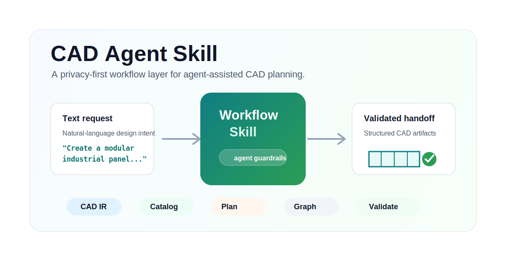
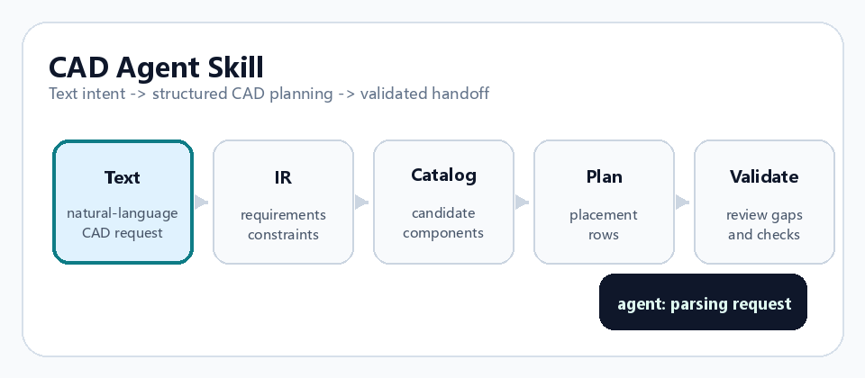

# CAD Agent Skill

A privacy-first workflow skill for CAD agents working on industrial design.

<p align="center">
  <a href="README.md"></a>
  <a href="README.zh-CN.md"></a>
</p>

<p align="center">
  
</p>

<p align="center">
  
</p>

This project helps CAD agents turn open-ended CAD requests into a deterministic package:

```text
inputs -> CAD IR -> component catalog query -> placement plan -> execution graph -> validation
```

It is designed for maintainers who want repeatable CAD planning, traceable
decisions, and safer automation before any geometry backend is asked to build
models.

## CAD Agent Skill Role

This repository is intended to work as a reusable skill layer for CAD agents.
It does not ask an agent to generate geometry in one free-form step. Instead,
it gives the agent a controlled workflow for translating CAD intent into
reviewable intermediate artifacts before a CAD backend is invoked.

As a CAD agent skill, it helps with:

- converting natural-language CAD requests into a structured CAD IR
- selecting reusable components from a documented component catalog
- producing deterministic placement plans for downstream CAD execution
- building an execution graph with checkpoints and traceable dependencies
- validating missing fields, unsafe assumptions, and review gaps before build

## Why This Exists

AI agents can draft CAD geometry quickly, but free-form generation is hard to
review and hard to reproduce. This repository provides a small, inspectable
compiler layer that forces every CAD decision through structured artifacts:

- `cad_ir.json`: normalized requirements, constraints, parts, and uncertainties
- `component_catalog.csv`: reusable component metadata
- `placement_plan.csv`: deterministic placement rows and review status
- `execution_graph.json`: ordered build and validation nodes
- validation reports: checks for missing fields, unsafe assumptions, and plan gaps

The repository contains only synthetic examples. It intentionally excludes
proprietary drawings, customer names, real CAD models, private paths, and
production component libraries.

## Quick Start

```powershell
python -m pip install -e .
python -m unittest discover -s tests
```

Create a compiler project:

```powershell
python -m cad_agent_skill init `
  --project-id demo-industrial-panel `
  --root .\out\demo-industrial-panel
```

Create an IR from public or synthetic notes:

```powershell
python -m cad_agent_skill create-ir `
  --project-id demo-industrial-panel `
  --out .\out\demo-industrial-panel\ir\cad_ir.json `
  --requirement "Create a modular industrial control panel with a frame, removable cover, hinge set, and access opening."
```

Query the synthetic component catalog:

```powershell
python -m cad_agent_skill query-catalog `
  --catalog .\examples\synthetic_component_catalog.csv `
  --category hinge `
  --min-confidence medium `
  --out .\out\demo-industrial-panel\planning\hinge_candidates.csv
```

Build and validate a placement plan:

```powershell
python -m cad_agent_skill build-plan `
  --selected .\examples\synthetic_selected_components.csv `
  --out .\out\demo-industrial-panel\planning\placement_plan.csv

python -m cad_agent_skill validate-placement `
  --placement-plan .\out\demo-industrial-panel\planning\placement_plan.csv `
  --out .\out\demo-industrial-panel\validation\placement_validation.json
```

## Repository Layout

```text
cad-agent-skill/
  src/cad_agent_skill/
    cli.py
    core.py
  examples/
    synthetic_component_catalog.csv
    synthetic_selected_components.csv
    synthetic_project/
  docs/
    architecture.md
    data-contract.md
    maintainer-workflow.md
    privacy-and-sanitization.md
  tests/
  .github/workflows/test.yml
```

## Scope

This project handles the planning and validation layer for CAD industrial
design automation. It is best understood as a CAD agent helper skill or
workflow compiler, not a replacement for a CAD kernel, CAD viewer, or modeling
backend. A downstream backend can consume the generated IR, placement plan, and
execution graph.

## Privacy Policy For This Repo

- Use synthetic examples by default.
- Do not commit private drawings, customer names, private CAD files, screenshots,
  business documents, or local machine paths.
- Keep production component catalogs outside the public repository.
- Replace real project labels with neutral names such as `demo`, `synthetic`,
  `panel`, `frame`, `cover`, `bracket`, and `fixture`.

See [Privacy And Sanitization](docs/privacy-and-sanitization.md) for the release
checklist.

## License

MIT
