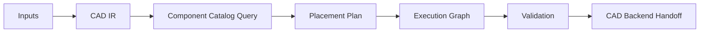

# Architecture

CAD Agent Skill is a planning layer for CAD industrial design automation. It does
not generate geometry directly. Instead, it produces deterministic artifacts
that a CAD backend can consume.

## Design Principles

- Structured inputs before geometry generation.
- Explicit source trace for every constraint.
- Component catalog rows are metadata, not private production assets.
- Low confidence rows require manual review.
- Validation runs before downstream CAD execution.
- Repair should target the smallest failed graph node.

## Main Artifacts

| Artifact | Purpose |
| --- | --- |
| `cad_ir.json` | Normalized requirements, constraints, parts, assemblies, and uncertainties. |
| `component_catalog.csv` | Searchable component metadata for reusable design elements. |
| `selected_components.csv` | Catalog rows selected for a project. |
| `placement_plan.csv` | Deterministic positions, rotations, parent assemblies, and review status. |
| `execution_graph.json` | Ordered nodes for input, planning, build, validation, repair, and export. |
| `validation_report.json` | Issues found before or after downstream CAD execution. |

## Backend Boundary

This repository stops at planning and validation. A downstream CAD backend may
turn the plan into STEP, native CAD files, drawings, or rendered previews.
